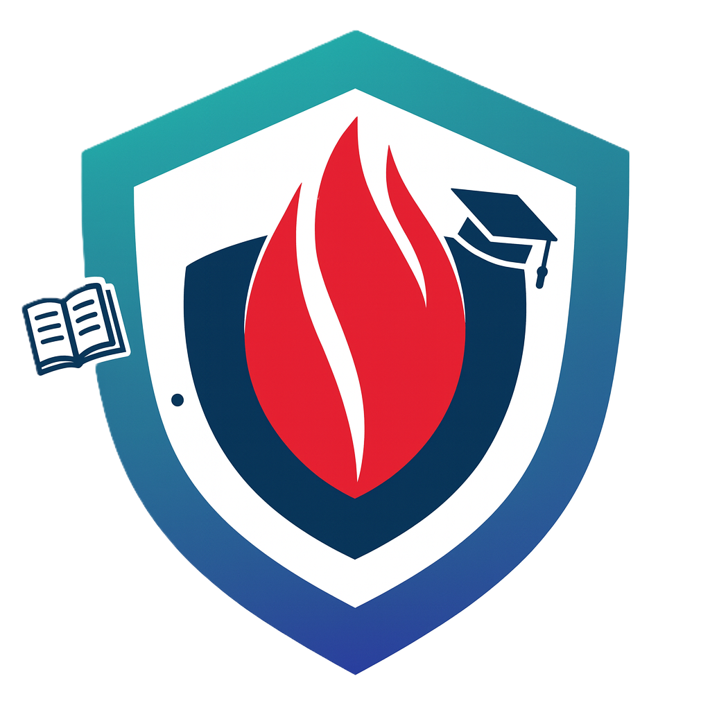
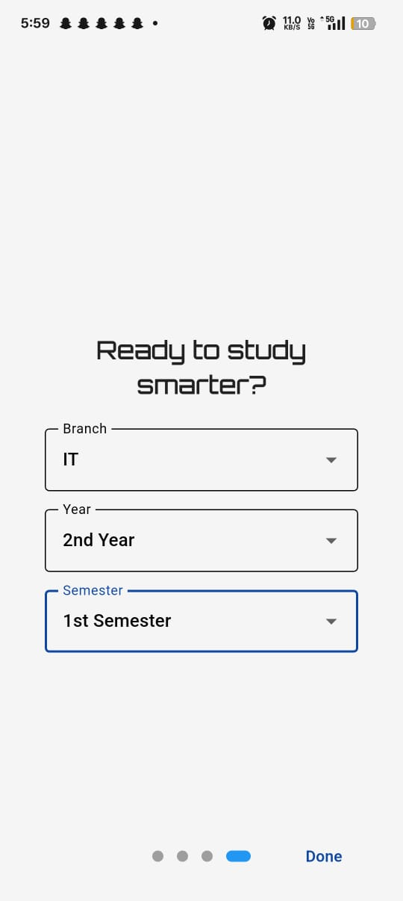
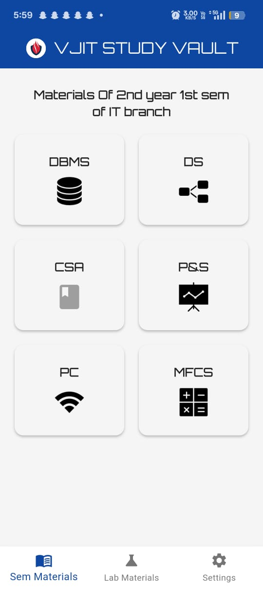
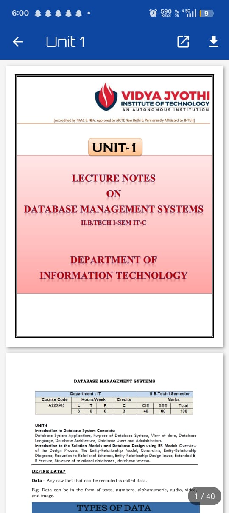
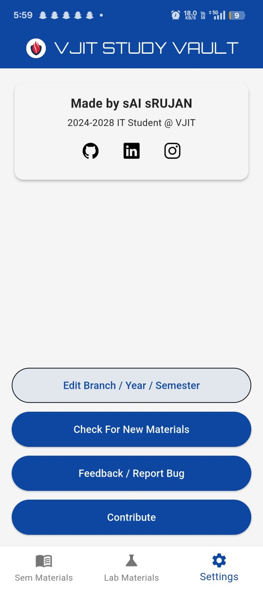

# 🎓 VJIT Study Vault PWA

*Your Complete Academic Companion - Now Accessible Anywhere, On Any Device*

[🌐 Open PWA](#live-pwa) • [📱 Download APK](#download) • [📖 Features](#features) • [🚀 Getting Started](#getting-started) • [🤝 Contributing](#contributing)

---

## 💡 Overview

### Evolution: From Mobile App to Universal PWA
**VJIT Study Vault** has evolved from a mobile-only application to a **Progressive Web App (PWA)**, making academic resources accessible on **any device with a browser** - laptops, tablets, phones, and desktops.

### Problem
Students struggle with **scattered study materials** across various platforms and need access from multiple devices - their phones during commute, laptops during study sessions, and tablets during classes.

### Solution
Our **PWA solution** centralizes all academic materials in a **cross-platform web application** that works seamlessly across all devices. It provides **personalized access** based on branch, year, and semester, with **offline capabilities** and **native-like performance**.

---

## 🌐 Live PWA

### 🚀 Access Instantly - No Installation Required

*Works on **all devices** - Desktop, Mobile, Tablet | **Offline Support** | **Install as App***

### 📱 Also Available as Native App

---

## ▶️ Demo

https://github.com/user-attachments/assets/1a1238f8-349c-4031-b768-61e1aaa4d48e

---

## 📱 Screenshots

| Onboarding | Setup | Materials Grid | PDF Viewer | About |
|:---:|:---:|:---:|:---:|:---:|
|  |  |  |  |  |

*Experience seamless navigation through your academic materials.*

---

## ✨ PWA Features

### � Universal Cross-Platform Access
- **Web-First Design**: Access from any browser on any device - Windows, Mac, Linux, Android, iOS
- **Responsive Layout**: Automatically adapts to desktop (wide screens), tablet (medium), and mobile (narrow) viewports  
- **No Installation Required**: Instant access via web browser at [vjitstudyvault.pages.dev](https://vjitstudyvault.pages.dev)
- **Progressive Enhancement**: Works even on slow networks with graceful degradation

### 📱 Native App-Like Experience  
- **Installable PWA**: Add to home screen on mobile or install as desktop app
- **Offline Support**: Browse downloaded materials without internet connection
- **Fast Loading**: Cached resources for instant subsequent loads via Service Workers
- **Smart Onboarding**: One-time setup with `introduction_screen` ^4.0.0 package

### 🎯 Smart Academic Personalization
- **Cross-Device Sync**: Your preferences sync across all devices via Firebase
- **Branch-Based Filtering**: See only materials relevant to your CSE/IT/ECE/EEE/MECH/CIVIL branch  
- **Year & Semester Organization**: Content automatically organized by your current academic level
- **Persistent Settings**: Configuration stored with `shared_preferences` ^2.5.3

### 📚 Enhanced Study Materials Access
- 📄 **Subject Notes** - Optimized for both mobile reading and desktop studying
- 📝 **Question Banks** - Interactive practice sessions across devices  
- 🎯 **Previous Year Papers** - Full-screen viewing on desktop, mobile-optimized on phones
- 🔬 **Lab Manuals** - Step-by-step guides accessible during practicals
- 📋 **Assignments** - Downloadable resources with cross-platform compatibility

### 🚀 Advanced PWA Technology
- **Smart PDF Handling**: `pdfx` ^2.6.0 for mobile + web browser PDF viewer for desktop
- **CORS-Free Loading**: Materials loaded via `http` ^1.1.0 from same domain (no CORS issues)
- **Analytics Integration**: Cloudflare Web Analytics for PWA metrics + Firebase Analytics for mobile apps

---

## 🔧 PWA Technology Stack

| Component | Technology | Purpose | Platform Support |
|:---|:---|:---|:---|
| **Frontend Framework** | Flutter 3.24+ Web | Cross-platform PWA development | All browsers |
| **PWA Core** | Service Workers + Web App Manifest | Offline caching & installability | All modern browsers |
| **PDF Rendering** | `pdfx` ^2.6.0 + Web fallback | High-performance PDF viewing | Mobile: pdfx native, Web: browser PDF |
| **Networking** | `http` ^1.1.0 + `dio` ^5.0.0 | CORS-free same-domain + fallback requests | Universal |
| **Local Storage** | `shared_preferences` ^2.5.3 | Cross-platform preferences (Web: localStorage) | All platforms |
| **PWA Analytics** | Cloudflare Web Analytics | Real-time page views & unique visitor tracking | Web (PWA) |
| **Mobile Analytics** | `firebase_analytics` ^12.0.2 | Detailed user behavior & event tracking | Mobile Apps |
| **Cloud Backend** | `firebase_core` ^4.1.1 | Authentication & real-time updates | Universal |
| **Content Delivery** | Google Drive API + Cloudflare CDN | PDF streaming & materials metadata | Global edge locations |
| **Hosting & CI/CD** | Cloudflare Pages + GitHub Actions | Automated PWA deployment | Worldwide |
| **Typography** | Poppins + Orbitron fonts | Professional, readable design | All platforms |

### 🤖 Automated CI/CD Pipeline
| Workflow | Purpose | Trigger | Technology |
|:---|:---|:---|:---|
| **PWA Build & Deploy** | Automatic deployment to Cloudflare Pages | Push to main branch | GitHub Actions + Flutter Web |
| **Materials Sync** | Updates study materials database | Every 6 hours + manual | CRON + API integration |

#### � Continuous Deployment Features:
- **Smart Build Triggers**: Only rebuilds when code changes (excludes materials.json updates)
- **Path-Based Filtering**: Monitors `lib/`, `web/`, `pubspec.yaml` for relevant changes
- **Cloudflare Integration**: Direct deployment to global CDN edge locations
- **Automated Material Updates**: Syncs with external materials database every 6 hours

---

## 🌐 Live Access & Downloads

### � Instant PWA Access

*No downloads • Works everywhere • Always updated • Install optional*

### 📱 Mobile Apps

*APK Size: ~50MB | Min Android: 5.0+ | PWA Alternative: 0MB (browser)*

---

## 🎯 Supported Academic Programs

| Branch | Years | Semesters |
|:---|:---|:---|
| **Computer Science & Engineering (CSE)** | 1st - 4th | 1st & 2nd | ✅ PWA + APK |
| **Information Technology (IT)** | 1st - 4th | 1st & 2nd | ✅ PWA + APK |
| **Electronics & Communication (ECE)** | 1st - 4th | 1st & 2nd | ✅ PWA + APK |
| **Electrical & Electronics (EEE)** | 1st - 4th | 1st & 2nd | ✅ PWA + APK |
| **Mechanical Engineering (MECH)** | 1st - 4th | 1st & 2nd | ✅ PWA + APK |
| **Civil Engineering (CIVIL)** | 1st - 4th | 1st & 2nd | ✅ PWA + APK |

*All branches fully supported across PWA and mobile platforms*

---

### 🌍 Global Deployment Architecture
- **Hosting**: Cloudflare Pages (300+ global edge locations)
- **CDN**: Cloudflare CDN for static assets
- **Materials Database**: JSON API hosted separately for updates
- **Auto-Sync**: GitHub Actions sync materials every 6 hours
- **SSL**: Automatic HTTPS via Cloudflare SSL

---

## 🚧 PWA Roadmap

### 🔮 Next Version Features
Upcoming enhancements focused on PWA optimization and user experience:

| Status | PWA Feature | Description |
|:---|:---|:---|
| [ ] | **Advanced Offline Mode** | Service Worker with background sync for complete offline access |
| [ ] | **PWA Install Prompts** | Smart install banners with usage-based prompting |
| [ ] | **Push Notifications** | Exam reminders and new material alerts via Web Push API | Q2 2025 |
| [ ] | **Dark Mode Theme** | System-aware dark/light theme with user preferences | Q1 2025 |
| [ ] | **Advanced Analytics** | Detailed study patterns and progress tracking | Q2 2025 |
| [ ] | **Video Integration** | Native video streaming with offline caching | Q2 2025 |
| [ ] | **Study Planner** | AI-powered personalized study schedules | Q3 2025 |
| [ ] | **Collaborative Notes** | Real-time shared note-taking and study groups | Q3 2025 |

*(For detailed technical tasks, see [TODO.txt](/TODO.txt))*

### 📅 Version History

| Version | Date | Platform | Key Features |
|:---|:---|:---|:---|
| **PWA v1.0** | 30/09/2025 | Web + Mobile | Progressive Web App with offline support, Cloudflare Analytics, cross-platform PDF viewing, automated CI/CD |
| **Mobile v1.0** | 29/09/2025 | Android/iOS | Initial Flutter mobile app with PDF viewing, secure downloads, Google Drive integration |

---

## 📄 License

This project is licensed under the **MIT License** - see the [LICENSE](LICENSE) file for full details.

---
**⚠ Disclaimer:** This is a **student-led, collaborative project** built for educational purposes. It is **not officially affiliated** with or endorsed by the VJIT administration.

---

*Made with ❤️ for VJIT Students*

**Empowering education through technology.**

