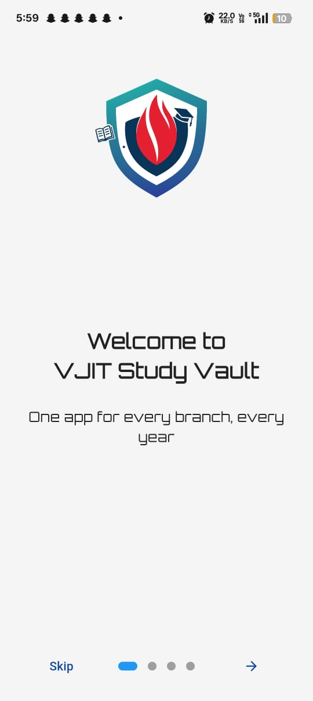

# 🎓 VJIT Study Vault

<div align="center">


*Your Complete Academic Companion for VJIT Students*

[](https://flutter.dev)
[](https://dart.dev)
[](https://firebase.google.com)
[](LICENSE)

[📱 Download APK](#download) • [📖 Features](#features) • [🚀 Getting Started](#getting-started) • [🤝 Contributing](#contributing)

</div>

---

## 💡 Overview

### Problem
Students often struggle to find **scattered study materials** across various WhatsApp groups and cloud drives. This leads to wasted time and difficulty in preparing for exams.

### Solution
**VJIT Study Vault** centralizes all necessary materials in one clean, efficient mobile application. It provides **personalized access** to content based on the student's **branch, year, and semester**, ensuring they see only what they need.

---

## ▶️ Demo


https://github.com/user-attachments/assets/1a1238f8-349c-4031-b768-61e1aaa4d48e


---

---

## 📱 Screenshots

<div align="center">

| Onboarding | Setup | Materials Grid | PDF Viewer | About |
|:---:|:---:|:---:|:---:|:---:|
|  |  |  |  |  |

*Experience seamless navigation through your academic materials.*

</div>

---

## ✨ Features

### 🎯 Personalized Academic Experience
- **Smart Onboarding**: Quick, one-time setup based on your branch, year, and semester.
- **Curated Content**: Automatically filters and displays *only* materials relevant to your academic profile.
- **Offline Access**: Download and access PDFs anytime, anywhere, without an internet connection.

### 📚 Comprehensive Study Materials
- 📄 **Subject Notes** - Chapter-wise organized study notes.
- 📝 **Question Banks** - Practice questions for comprehensive exam preparation.
- 🎯 **Previous Year Papers** - Year-wise collections of official PYQs.
- 🔬 **Lab Manuals** - Practical experiment guides.
- 📋 **Assignments** - Course-specific assignments and their solutions.

### 🚀 Advanced PDF Management
- **Native PDF Rendering**: Smooth, high-quality viewing experience with the `pdfx` library.
- **Intuitive Navigation**: Scrollbar with page indicators for easy browsing.
- **Quick Access**: Direct **Google Drive integration** for instant material sourcing.
- **Download Management**: MediaStore-compliant file saving for modern Android versions (10+).

### 🎨 Modern UI/UX
- **Material Design 3**: A clean, intuitive interface following Google's latest design standards.
- **Enhanced Readability**: Utilizes the **Orbitron** font family for a distinct, modern look.
- **Responsive Layout**: Optimized to look great on all mobile screen sizes.

---

## 🔧 Technology Stack

| Component | Technology | Purpose |
|:---|:---|:---|
| **Frontend** | Flutter 3.0+ | Cross-platform mobile application development |
| **PDF Rendering** | `pdfx` | High-performance PDF viewing |
| **Networking** | `Dio` | Efficient HTTP requests and file downloads |
| **Local Storage** | `SharedPreferences` | User preferences and state persistence |
| **Analytics** | Firebase Analytics | Usage tracking and performance insights |
| **Cloud Storage** | Google Drive API | PDF hosting and seamless content delivery |
| **Database/Hosting** | Firebase Hosting | Hosting the central JSON database for materials |

---

## 🚀 Getting Started

### Prerequisites

- **Flutter SDK** ($\ge$ 3.0)
- **Dart SDK** ($\ge$ 3.0)
- **Git**
- An IDE (Android Studio or VS Code)

### Installation Steps

1.  **Clone the repository:**
    ```bash
    git clone [https://github.com/saiusesgithub/vjitstudyvault.git](https://github.com/saiusesgithub/vjitstudyvault.git)
    cd vjitstudyvault
    ```

2.  **Install dependencies:**
    ```bash
    flutter pub get
    ```

3.  **Firebase Setup** (for development/testing):
    * Add your `google-services.json` to `android/app/`
    * Add your `GoogleService-Info.plist` to `ios/Runner/`

4.  **Run the app:**
    ```bash
    flutter run
    ```

### 🏗 Build for Production

| Platform | Command |
|:---|:---|
| **Android APK** | `flutter build apk --release` |
| **iOS IPA** | `flutter build ios --release` |
| **Web** | `flutter build web --release` |

---

## 📥 Download

<div align="center">

### 📱 Get VJIT Study Vault

[](https://github.com/saiusesgithub/VJIT-Study-Vault/releases/tag/v1.0)


*Latest Version: **v1.0.0** | **Size: approx 50MB** | **Min Android**: 5.0 (Lollipop)+*

</div>

---

## 🎯 Supported Academic Programs

<div align="center">

| Branch | Years | Semesters |
|:---|:---|:---|
| **Computer Science & Engineering (CSE)** | 1st - 4th | 1st & 2nd |
| **Information Technology (IT)** | 1st - 4th | 1st & 2nd |
| **Artificial Intelligence & ML (AIML)** | 1st - 4th | 1st & 2nd |
| **Data Science (DS)** | 1st - 4th | 1st & 2nd |
| **Electronics & Communication (ECE)** | 1st - 4th | 1st & 2nd |
| **Electrical & Electronics (EEE)** | 1st - 4th | 1st & 2nd |

*More branches and programs coming soon!*

</div>

---

## 🤝 Contributing

We welcome contributions from the community! There are many ways to help improve VJIT Study Vault:

### 📋 Ways to Contribute

- 🐛 **Report Bugs**: Found an issue? Open a new issue with a clear description.
- 💡 **Suggest Features**: Share your ideas for new functionalities.
- 📚 **Add Study Materials**: Contribute your high-quality notes, question banks, or papers.
- 🔧 **Code Contributions**: Help improve the app's performance and add new features.
- 📖 **Documentation**: Enhance our guides and documentation.

### 🔧 Development Setup

1.  **Fork** the repository.
2.  Create a feature branch: `git checkout -b feature/amazing-feature`
3.  Commit your changes: `git commit -m 'feat: Add amazing feature'`
4.  Push to the branch: `git push origin feature/amazing-feature`
5.  **Open a Pull Request** (PR).

---

## 🚧 Roadmap

### 🔮 Upcoming Features
We're excited to announce the next set of features planned for the app:

| Status | Feature |
|:---|:---|
| [ ] | **Offline Sync** - Download entire subjects for comprehensive offline access. |
| [ ] | **Study Planner** - AI-powered recommendations for a personalized study schedule. |
| [ ] | **Video Lectures** - Integrated support for video content. |
| [ ] | **Exam Reminders** - A smart notification system for important dates. |

*(For a complete list of planned tasks, see the [Todo File](/TODO.txt).)*

### 📅 Version History

| Version | Date | Key Features |
|:---|:---|:---|
| **v1.0** | 29/09/2025 | Initial release with PDF viewing, secure downloads, and Google Drive integration. |

---

## 📄 License

This project is licensed under the **MIT License** - see the [LICENSE](LICENSE) file for full details.

---
**⚠ Disclaimer:** This is a **student-led, collaborative project** built for educational purposes. It is **not officially affiliated** with or endorsed by the VJIT administration.

---
<div align="center">

*Made with ❤️ for VJIT Students*

**Empowering education through technology.**

[](https://github.com/saiusesgithub/vjitstudyvault)

</div>
